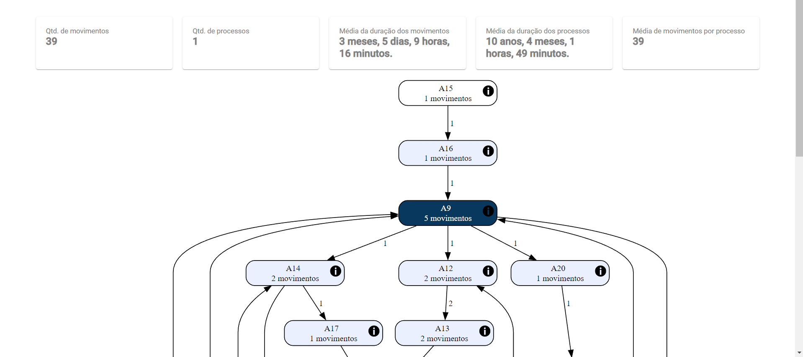
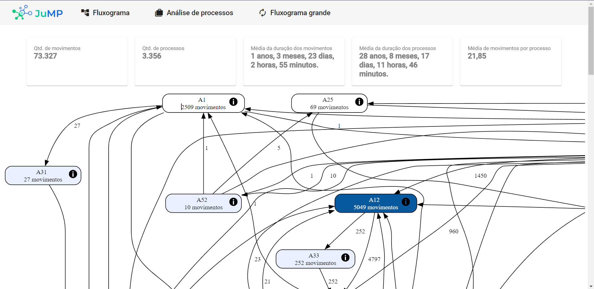
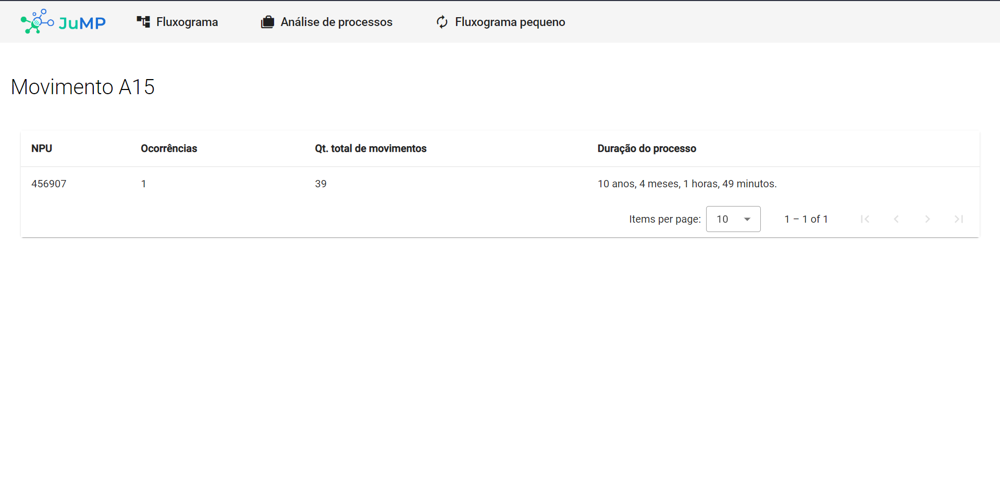
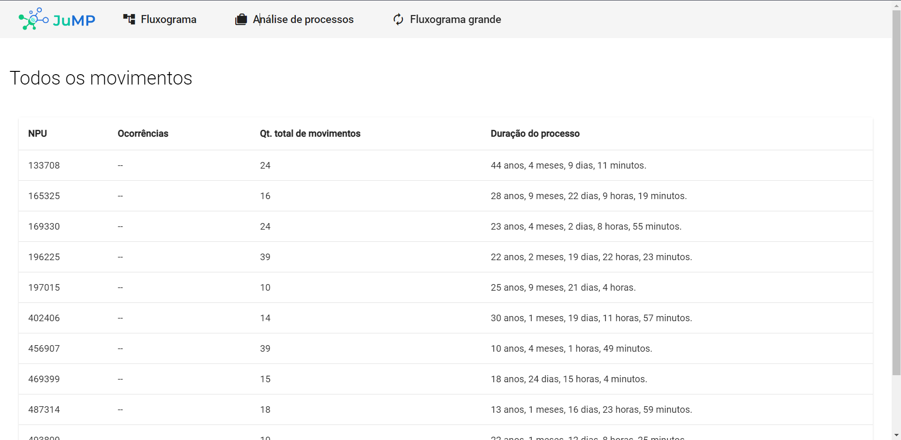

# JuMP - Judiciário & Mineração de Processos

## Aplicação para análise de processos

#### Feita durante processo seletivo para time do JuMP - V-Lab UFPE

### Features 🛠️

- [x] Visualização de fluxogramas de processos
- [x] Visualização de estatísticas gerais sobre processos
- [x] Detalhamento de processos que realizam movimentos específicos
- [x] Listagem de todos os movimentos realizados nos processos
- [x] Possibilidade de alternar entre os fluxogramas grande e pequeno da aplicação
- [x] Correção de diversos bugs na aplicação inicial

### Pré-requisitos ❗

- NodeJS
- Python
- Graphviz
- Docker

### Como utilizar ⚙️

#### Modo de desenvolvimento

```bash
# Clone este repositório em sua máquina.
$ git clone https://github.com/fpeduu/SelecaoJump jump

# Acesse a pasta do projeto no terminal/cmd.
$ cd jump

# Abra outro terminal
# No primeiro, instale as dependências do frontend
$ cd frontend
$ npm i

# Inicie o frontend da aplicação
$ npm start

# No segundo, instale as dependências do backend
$ cd backend
$ pip install -r requirements.txt

# Inicie o backend da aplicação
$ python -m uvicorn main:app --reload

# Agora basta acessar o projeto, em localhost:4200
```

#### Modo de produção

```bash
# Na pasta raíz da aplicação, inicie o docker
$ docker compose up -d

# Após isso, basta acessar o projeto, em localhost, ou localhost:80
```

### Demonstração









### Tecnologias 🚀

- [NodeJS](https://nodejs.org/)
- [Typescript](https://www.typescriptlang.org/)
- [Angular](https://angular.io/)
- [Python](https://www.python.org/)
- [FastAPI](https://fastapi.tiangolo.com/)
- [Pandas](https://pandas.pydata.org/)
- [Docker](https://www.docker.com/)
